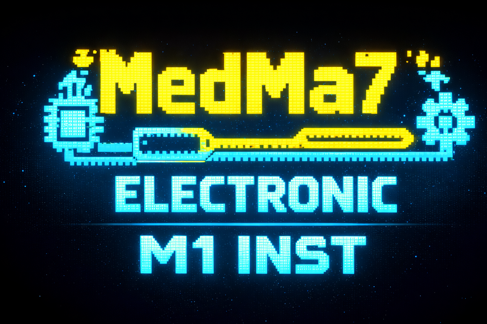

# 👻 GhostChat — Encrypted Grid | ESP32
# `Phase 1 — Single Node`

<table width="100%">
  <tr>
    </th>
    <th align="center">
      
    </th>
</table>

<div align="left" >
  ---


<div align="center" width="340px" >

```
  ██████╗ ██╗  ██╗ ██████╗ ███████╗████████╗ ██████╗██╗  ██╗ █████╗ ████████╗
 ██╔════╝ ██║  ██║██╔═══██╗██╔════╝╚══██╔══╝██╔════╝██║  ██║██╔══██╗╚══██╔══╝
 ██║  ███╗███████║██║   ██║███████╗   ██║   ██║     ███████║███████║   ██║
 ██║   ██║██╔══██║██║   ██║╚════██║   ██║   ██║     ██╔══██║██╔══██║   ██║
 ╚██████╔╝██║  ██║╚██████╔╝███████║   ██║   ╚██████╗██║  ██║██║  ██║   ██║
  ╚═════╝ ╚═╝  ╚═╝ ╚═════╝ ╚══════╝   ╚═╝    ╚═════╝╚═╝  ╚═╝╚═╝  ╚═╝   ╚═╝
```

**No internet. No cloud. No trace. Just signal.**


> A self-hosted, offline private encrypted chat room running entirely on a single ESP32.
> No internet. No cloud. No server. No trace. Just plug in and talk.

</div>

---

# 💡 Idea & Concept

> ⚠️  **The idea, architecture, and design of this project are entirely mine.**
> The system logic, communication protocol, UI concept, and overall structure were all planned and thought through by me from scratch.
> The code was generated with the help of AI based on my exact specifications and requirements — every decision, every feature, every detail was defined by me.
> This documentation exists so others can understand the thinking and reasoning behind the project, not just read code.

The idea is simple but powerful:

- The **ESP32 acts as both the WiFi router AND the web server**
- Anyone who joins the ESP32's WiFi network can open a browser and **enter a secret password** to access a private chat room
- Users can chat in the **public lobby** (everyone sees it) or send **direct private messages** to a specific person
- The **TFT screen** on the ESP32 shows who is online in real time
- **No internet required** — works completely offline, anywhere

This is **Part 1** of a 2-part project. Part 2 will expand this into a **multi-room, multi-ESP32 mesh network** using NRF24L01 PA+LNA radio modules.

---

## 📁 Project Structure

```
ESP32_ChatRoom/
│
├── 📁 Assets/                              # Images and visual resources
│   ├── Principale-Logo.png                    # University main logo
|
|
├── ESP32_ChatRoom.ino     ← Main sketch (everything in one file)
│   ├── Pin definitions
│   ├── WiFi AP setup
│   ├── WebSocket server + event handler
│   ├── TFT display functions
│   ├── User session management
│   ├── Message routing logic
│   └── HTML/CSS/JS  (embedded as PROGMEM string)
|
└── README.md              ← This file
```
---
## ✨ Features (Part 1)

| Feature | Description |
|---|---|
| 🔑 **Password Login** | Secret room key + custom username |
| 🌐 **Lobby Chat** | All connected users in one room |
| 🔒 **Private Messages** | Direct 1-to-1 private conversation |
| 👥 **Live User List** | See who is online, click to PM |
| 📺 **TFT Dashboard** | Real-time display: users, messages, status |
| 🔄 **Auto Reconnect** | WebSocket auto-reconnects on drop |
| 📱 **Mobile Friendly** | Works on any browser, any device |
| 🚫 **No Internet** | 100% offline, self-contained |

---

## 🧰 Hardware Required

| Component | Spec |
|---|---|
| **ESP32** | 38-pin DevKit v3 (ESP-WROOM-32) |
| **TFT Display** | 1.8" ST7735S — 128×160 RGB |

> 🔮 Reserved for Part 2: NRF24L01 PA+LNA module

---

## 📌 Pinout — ESP32 38-pin DevKit


```
                    ┌─────────────────────┐
               3V3 ─┤ 1                38 ├─ GND
               GND ─┤ 2                37 ├─ GPIO23 (TFT MOSI)
               EN  ─┤ 3                36 ├─ GPIO22
            GPIO36 ─┤ 4                35 ├─ GPIO21
            GPIO39 ─┤ 5                34 ├─ GPIO19 (NRF MISO — Part 2)
            GPIO34 ─┤ 6                33 ├─ GPIO18 (TFT CLK)
            GPIO35 ─┤ 7                32 ├─ GPIO5  (NRF CSN — Part 2)
            GPIO32 ─┤ 8                31 ├─ GPIO4
            GPIO33 ─┤ 9                30 ├─ GPIO0
            GPIO25 ─┤10                29 ├─ GPIO2  (TFT DC)
            GPIO26 ─┤11                28 ├─ GPIO15 (TFT RST)
            GPIO27 ─┤12                27 ├─ GPIO8
            GPIO14 ─┤13      ◄─ TFT CS 26 ├─ GPIO7
            GPIO12 ─┤14                25 ├─ GPIO6
               GND ─┤15                24 ├─ GPIO1
            GPIO13 ─┤16                23 ├─ GPIO3
             GPIO9 ─┤17                22 ├─ GPIO17 (NRF CE — Part 2)
            GPIO10 ─┤18                21 ├─ GPIO16
            GPIO11 ─┤19                20 ├─ VIN
                    └─────────────────────┘
```

---

## 🔌 Wiring Diagram — ESP32 + ST7735S


```
  ESP32 DevKit 38-pin                  ST7735S 1.8" TFT
  ─────────────────                    ────────────────
                                       ┌──────────────┐
  3.3V ──────────────────────────────► │ VDD          │
  GND  ──────────────────────────────► │ GND          │
  GPIO 23 (SDA/MOSI) ────────────────► │ SDA          │
  GPIO 18 (SCL/CLK)  ────────────────► │ SCL          │
  GPIO 15            ────────────────► │ RST / RESET  │
  GPIO  2            ────────────────► │ DC / RS      │
  GPIO 13            ────────────────► │ CS           │
  3.3V ── 220Ω ──────────────────────► │ BLK / LED    │
                                       └──────────────┘
 
  ⚠️  Use 3.3V only — ST7735S is NOT 5V tolerant!
  ⚠️  BLK wired to 3.3V via 220Ω resistor — always ON, no GPIO needed
  ⚠️  If screen shows all white → check RST wiring (GPIO15)
```

### Visual Wiring Layout

```
                  ┌───────────────────────────────────────┐
                  │           ESP32 DevKit                │
                  │                                       │
                  │  [3V3]──────────────────── VDD        │
                  │  [GND]──────────────────── GND        │
                  │  [G23]──────────────────── SDA        │◄── SPI MOSI
                  │  [G18]──────────────────── SCL        │◄── SPI CLK
                  │  [G15]──────────────────── RST        │◄── Hardware Reset
                  │  [G02]──────────────────── DC         │◄── Data/Command
                  │  [G13]──────────────────── CS         │◄── Chip Select
                  │  [3V3]──220Ω──────────────BLK         │◄── Backlight (always ON)
                  │                                       │
                  └───────────────────────────────────────┘
```

---

## ⚙️ Configuration

At the top of `ESP32_ChatRoom.ino`, change these 3 values:

```cpp
#define WIFI_SSID   "ESP32_ChatRoom"   // WiFi network name (visible to users)
#define WIFI_PASS   "esp32chat"        // WiFi password    (min 8 characters)
#define ROOM_KEY    "vip2024"          // Secret room key  (users enter this)
```

---

## 📚 Required Libraries

Install all via **Arduino IDE → Tools → Manage Libraries**:

| Library | Author | Version |
|---|---|---|
| `ESPAsyncWebServer`    | lacamera | latest |
| `AsyncTCP`             | dvarrel | latest |
| `ArduinoJson`          | Benoit Blanchon | **6.x only** |
| `Adafruit GFX Library` | Adafruit | latest |
| `Adafruit ST7735 and ST7789 Library` | Adafruit | latest |

> 💡 When installing Adafruit GFX it will ask **"Install all dependencies?"** → click **YES**

### Board Setup (if not done yet)

1. **File → Preferences → Additional Boards Manager URLs**, add:
```
https://raw.githubusercontent.com/espressif/arduino-esp32/gh-pages/package_esp32_index.json
```
2. **Tools → Board → Boards Manager** → search `esp32` → install by **Espressif Systems**
3. **Tools → Board → ESP32 Arduino → ESP32 Dev Module**

---

## 🧠 How It Works — System Logic

### High-Level Architecture

```
┌─────────────────────────────────────────────────────────┐
│                     ESP32 (Single Chip)                 │
│                                                         │
│   ┌──────────────┐      ┌──────────────────────────┐    │
│   │  WiFi Driver │      │    WebSocket Server       │   │
│   │  (AP Mode)   │◄────►│    (Port 80 — /ws)        │   │
│   │  192.168.4.1 │      │                           │   │
│   └──────────────┘      │  ┌───────────────────┐    │   │
│                         │  │   User Sessions   │    │   │
│   ┌──────────────┐      │  │   Map<ID, User>   │    │   │
│   │  HTTP Server │      │  └───────────────────┘    │   │
│   │  Serves HTML │      │                           │   │
│   │  (1 page app)│      │  ┌────────┐ ┌─────────┐   │   │
│   └──────────────┘      │  │ Lobby  │ │Private  │   │   │
│                         │  │ Room   │ │Messages │   │   │
│   ┌──────────────┐      │  └────────┘ └─────────┘   │   │
│   │  ST7735S TFT │◄─────┴───────────────────────────┘   │
│   │  Dashboard   │                                      │
│   └──────────────┘                                      │
└─────────────────────────────────────────────────────────┘
              ▲
              │ WiFi (2.4GHz)
    ┌─────────┴──────────┐
    │   Connected Users  │
    │  (phones, laptops) │
    │   Max: 8 devices   │
    └────────────────────┘
```

### Connection Flow

```
User opens WiFi settings
        │
        ▼
Connects to "ESP32_ChatRoom"  (WiFi password)
        │
        ▼
Opens browser → http://192.168.4.1
        │
        ▼
ESP32 serves the HTML page  (single-page app)
        │
        ▼
Browser opens WebSocket connection to ws://192.168.4.1/ws
        │
        ▼
ESP32 sends:  { "type": "ask_login" }
        │
        ▼
User enters Room Key + Username → browser sends:
{ "type": "login", "password": "vip2024", "username": "Ahmed" }
        │
        ├── Wrong password?  → { "type": "login_fail", "msg": "Wrong password!" }
        ├── Name taken?      → { "type": "login_fail", "msg": "Username taken!" }
        │
        ▼
Auth OK → { "type": "login_ok", "username": "Ahmed" }
        │
        ▼
User enters the Chat Room ✅
```

---

## 📊 Algorithm — Step by Step

### 1. Startup Sequence

```
START
  │
  ├─► Initialize TFT → show splash screen
  │
  ├─► Start WiFi in AP mode
  │     SSID: "ESP32_ChatRoom"
  │     IP:   192.168.4.1
  │     Max:  8 clients
  │
  ├─► Attach WebSocket handler to /ws
  │
  ├─► Start HTTP server on port 80
  │     GET "/" → serve HTML page
  │     Any other URL → redirect to "/"
  │
  └─► TFT: show IP + waiting screen
```

### 2. WebSocket Event Handler

```
ON WS_EVENT_CONNECT (new client):
  ├─► Add client to users map: { id, username="", authenticated=false }
  └─► Send: { type: "ask_login" }

ON WS_EVENT_DISCONNECT (client left):
  ├─► Get username + private partner ID
  ├─► Remove from users map
  ├─► If had private partner → notify them: { type: "partner_left" }
  ├─► Broadcast to lobby: { type: "user_left", username }
  ├─► Update user list for everyone
  └─► Refresh TFT display

ON WS_EVENT_DATA (message received):
  ├─► Parse JSON
  ├─► Switch on message type:
  │
  ├── "login":
  │     ├── Validate password == ROOM_KEY
  │     ├── Validate username length (2-12 chars)
  │     ├── Check username not already taken
  │     ├── On fail → send { type: "login_fail", msg: "..." }
  │     └── On success:
  │           ├── Mark user as authenticated
  │           ├── Send { type: "login_ok" }
  │           ├── Send user list to new user
  │           ├── Broadcast { type: "user_joined" } to others
  │           └── Update TFT
  │
  ├── "lobby_msg":
  │     ├── Check sender is authenticated
  │     ├── Validate text (not empty, max 200 chars)
  │     ├── Increment totalMessages counter
  │     ├── Broadcast to ALL authenticated users:
  │     │     { type: "lobby_msg", from: "Ahmed", text: "..." }
  │     └── Update TFT
  │
  ├── "private_msg":
  │     ├── Check sender is authenticated
  │     ├── Find target user by username
  │     ├── If not found → send { type: "error", msg: "User not found" }
  │     ├── Track private partner IDs (for disconnect notifications)
  │     ├── Send to SENDER (echo):   { type: "private_msg", from, to, text }
  │     ├── Send to TARGET:          { type: "private_msg", from, to, text }
  │     └── Update TFT
  │
  └── "ping":
        └── Send: { type: "pong" }
```

### 3. TFT Update Logic

```
Every 500ms in loop():
  ├── Count authenticated users
  ├── Clear screen
  ├── Draw header bar (cyan)
  ├── Draw stats row: "Users: N  |  Msgs: N"
  └── For each authenticated user:
        ├── Green dot  = user is in lobby
        ├── Purple dot = user is in private chat
        ├── Show username (max 10 chars)
        └── Show room status (Lobby / PM)
```

### 4. WebSocket Message Protocol

All messages are JSON. Here are all message types:

```
CLIENT → SERVER:
┌─────────────────┬──────────────────────────────────────────────┐
│ Type            │ Payload                                      │
├─────────────────┼──────────────────────────────────────────────┤
│ login           │ { password, username }                       │
│ lobby_msg       │ { text }                                     │
│ private_msg     │ { to: "username", text }                     │
│ ping            │ {}                                           │
└─────────────────┴──────────────────────────────────────────────┘

SERVER → CLIENT:
┌─────────────────┬──────────────────────────────────────────────┐
│ Type            │ Payload                                      │
├─────────────────┼──────────────────────────────────────────────┤
│ ask_login       │ {}                                           │
│ login_ok        │ { username }                                 │
│ login_fail      │ { msg }                                      │
│ users_list      │ { users: ["name1", "name2", ...] }          │
│ user_joined     │ { username }                                 │
│ user_left       │ { username }                                 │
│ lobby_msg       │ { from, text }                               │
│ private_msg     │ { from, to, text }                           │
│ partner_left    │ { username }                                 │
│ error           │ { msg }                                      │
│ pong            │ {}                                           │
└─────────────────┴──────────────────────────────────────────────┘
```

---

## 🖥️ Web UI — Interface Preview

### Login Screen
```
╔══════════════════════════════════════╗
║ ● ● ●   esp32-chatroom — secure      ║
╠══════════════════════════════════════╣
║                                      ║
║           [  ESP32 ICON  ]           ║
║                                      ║
║         C H A T R O O M              ║
║   [ PRIVATE ACCESS — ESP32 NODE ]    ║
║                                      ║
║  ROOM PASSWORD                       ║
║  🔑 | ••••••••                      ║
║                                      ║
║  YOUR CALLSIGN                       ║
║  $  | Ahmed_                         ║
║                                      ║
║        [ ACCESS ROOM ]               ║
║                                      ║
╚══════════════════════════════════════╝
```

### Chat Screen
```
╔══════════════════════════════════════════════════════╗
║ ● ESP32 // CHAT HUB                YOU: Ahmed        ║
╠══════════╦═══════════════════════════════════════════╣
║ 🌐 LOBBY ║ 🔒 PM [2]                                ║
╠══════════╬═══════════════════════════════════════════╣
║ ⬤ ONLINE ║                                           ║
║──────────║  ─── Ahmed joined the room ───            ║
║ ● Karim  ║                                           ║
║ ● Yacine ║  Ahmed           14:22                    ║
║ ● Sara   ║  salam everyone!                          ║
║          ║                                           ║
║          ║  Karim           14:22                    ║
║          ║  wach rak Ahmed!                          ║
║          ║                                           ║
║          ║  You             14:23                    ║
║          ║  labas hamdullah                          ║
║          ╠═══════════════════════════════════════════╣
║          ║  Type a message...                  [ ➤ ] ║
╚══════════╩═══════════════════════════════════════════╝
```

### TFT Display (128×160 — Landscape)
```
┌────────────────────────────┐
│      ESP32 ChatRoom        │  ← Cyan header bar
├────────────────────────────┤
│  Users: 3      Msgs: 12    │  ← Dark stats row
├────────────────────────────┤
│  Online:                   │
│  ● Ahmed         Lobby     │  ← Green dot = lobby
│  ● Karim         Lobby     │
│  ◉ Yacine        PM        │  ← Purple dot = private
│                            │
├────────────────────────────┤
│▓▓▓▓▓▓▓▓▓▓▓▓▓▓▓▓▓▓▓▓▓▓▓▓▓▓│  ← Cyan accent bar
└────────────────────────────┘
```

---

## 🚀 Flash & Run

1. Open `ESP32_ChatRoom.ino` in Arduino IDE
2. Select **Tools → Board → ESP32 Dev Module**
3. Select the correct **COM port**
4. Click **Upload** ⬆️
5. Open **Serial Monitor** at **115200 baud** to see logs
6. Connect your phone/laptop to WiFi: **`ESP32_ChatRoom`**
7. Open browser: **`http://192.168.4.1`**
8. Enter the room key and your username → you're in!

---

## 🔍 Serial Monitor Output

```
╔══════════════════════════════╗
║  ESP32 Chat Room — Phase 1   ║
╚══════════════════════════════╝
[WiFi] Starting AP: 'ESP32_ChatRoom'
[WiFi] AP IP: 192.168.4.1
[WiFi] SSID: ESP32_ChatRoom / PASS: esp32chat
[Room] Key: vip2024
[Server] Started! Open http://192.168.4.1 in browser

[WS] Client #1 connected from 192.168.4.2
[LOGIN] ✅ 'Ahmed' joined (#1)
[WS] Client #2 connected from 192.168.4.3
[LOGIN] ✅ 'Karim' joined (#2)
[LOBBY] Ahmed: salam!
[PM] Ahmed → Karim: rak labas?
[WS] Client #2 (Karim) disconnected
```

---

## 🔧 Troubleshooting

| Problem | Cause | Fix |
|---|---|---|
| TFT all white | Wrong `initR()` type | Try `INITR_GREENTAB`, `INITR_REDTAB`, `INITR_BLACKTAB` |
| TFT all white | Bad RESET wiring | Check GPIO15 → RES pin |
| TFT no backlight | BL not connected | Connect GPIO32 → BLK, or wire BLK directly to 3.3V |
| Can't see WiFi | ESP32 not booted | Check serial monitor, press EN button |
| Browser blank | Wrong URL | Use `http://192.168.4.1` — no https! |
| Compile error | Wrong library version | ArduinoJson must be v6.x not v7 |
| Upload fails | Wrong board | Select "ESP32 Dev Module" |

---


---

## 🔮 GhostChat Phase 2 — Coming Soon: Encrypted Mesh Grid

> Part 2 takes this system and scales it into a full **multi-node wireless chat mesh**.

### Architecture

```
                     ┌──────────────────────────────┐
                     │     ESP32 HUB (Master)        │
                     │  WiFi AP + WebSocket Server   │
                     │  ST7735S TFT Dashboard         │
                     │  NRF24L01 PA+LNA (RF Master)  │
                     └──────────────┬───────────────┘
                                    │
                       RF 2.4GHz (NRF24L01)
                  ┌─────────────────┼─────────────────┐
                  │                 │                 │
        ┌─────────┴──────┐ ┌───────┴──────┐ ┌────────┴───────┐
        │  ESP32 Node A  │ │ ESP32 Node B │ │  ESP32 Node C  │
        │  Room: Office  │ │ Room: Lab    │ │  Room: Lounge  │
        │  WiFi AP       │ │ WiFi AP      │ │  WiFi AP       │
        │  NRF24L01      │ │ NRF24L01     │ │  NRF24L01      │
        └────────────────┘ └──────────────┘ └────────────────┘
              │                   │                  │
         Local users         Local users        Local users
         (via WiFi)          (via WiFi)         (via WiFi)
```

### Part 2 Features Planned

- 🏠 **Multiple named rooms** — each ESP32 is one room
- 📡 **NRF24L01 RF relay** — messages hop between nodes wirelessly
- 📬 **Message queue** — stored if target node is temporarily offline
- 🗺️ **Room discovery** — list all rooms from any node
- 🔐 **Per-room passwords** — different key per room
- 📊 **Hub TFT** — global overview: all rooms, all users, all activity

### RF Packet Structure (Part 2 Preview)

```cpp
struct RF_Packet {
    uint8_t  type;          // MSG, ACK, JOIN, LEAVE, PRIVATE
    uint8_t  room_id;       // 0=Hub, 1=NodeA, 2=NodeB, 3=NodeC
    uint8_t  sender_id;     // User ID (1-255)
    uint8_t  target_id;     // 0=broadcast, X=private target
    char     username[10];  // Sender name
    char     message[20];   // Message content
    uint8_t  checksum;      // Integrity check
};
// Total = 32 bytes — exactly NRF24L01 max payload size
```

---

## 📜 License

This project is open source. Feel free to use, modify, and build on it — just keep the credit.

---

<div align="center">

**👻 GhostChat — Built from scratch. No cloud. No BS. No trace.**

⭐ Star this repo if you found it useful!

`GhostChat-Encrypted-Grid-ESP32` · Phase 1 of 2

</div>
---

## ☕ Support My Work

---

### 🌐 Connect with Me (El-Amine):

<p>
<a href="https://www.linkedin.com/in/medma7/"></a>
<a href="https://github.com/MedMA07"></a>
<a href="https://linktr.ee/el.amine.m"></a>
<a href="https://www.instagram.com/el.amine.m/"></a>
<a href="https://t.me/med_ma7"></a>
<a href="https://api.whatsapp.com/send/?phone=213668598710"></a>
<a href="https://www.facebook.com/el.aminem07"></a>
<a href="https://www.snapchat.com/add/med_ma7"></a>
</p>

📧 **Email:** elaminemed.ad@gmail.com <br>
📱 **Phone/WhatsApp:** +213 668 59 87 10 <br>
📍 **Location:** Oran, Algeria


<div align="center">

*Always open to internships, technical collaborations, and new challenges!*

**⭐ If this project helped you, don't forget to star the repository! ⭐**

</div>

